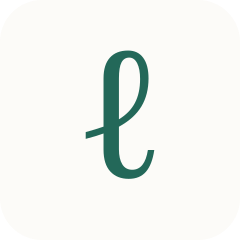

<p align="center">
  
</p>

<h1 align="center">Lean Exposition</h1>

<p align="center">
  <strong>An expandable reading view for Lean mathematics.</strong>
</p>

<p align="center">
  <a href="https://www.python.org/">
    
  </a>
  <a href="https://lean-lang.org/">
    
  </a>
  
</p>

Lean Exposition is an early research prototype for reading a Lean development
as a continuous mathematical exposition. It connects an expandable exposition
tree with a dependency graph, so a reader can move between a high-level account
and the declarations and source evidence underneath it.

The project is exploring the same reading model for people and software Agents.
Its current direction includes structured imports from Lean projects and
[Lean Constellation](https://github.com/iiis-lean/lean-constellation),
hierarchical dependency graphs, progressively generated exposition, and shared
web, HTTP, and MCP reading operations.

> [!WARNING]
> Lean Exposition is under active development. APIs, schemas, generated
> artifacts, prompts, and interface behavior may change directly as the design
> evolves. Generated prose is not a formal verification result.

## Current snapshot

The repository currently contains working foundations for:

- a shared fact model and experimental Lean Constellation/native Lean importers;
- dependency queries, source ordering, declaration grouping, and Region construction;
- immutable exposition snapshots with expansion and collapse operations;
- a local web reader synchronized with a dependency graph;
- experimental API and Agent execution adapters; and
- structural recommendation and evaluation scaffolding.

These components have focused tests and several local research fixtures, but the
project is not yet a stable library or supported production service. See the
[`docs/`](docs/) directory for the current technical notes. Research datasets,
generated examples, credentials, and active internal design records are not
included in the public repository.

## Try the local demo

The handwritten demo does not require model credentials:

```bash
python -m pip install -e '.[reader]'
python -m lean_exposition.app --state-dir data/reader-demo --port 8765
```

Open <http://127.0.0.1:8765/>. Model-backed generation and project loading are
experimental and require additional configuration; start with
[`docs/reader.md`](docs/reader.md) and [`docs/runtime.md`](docs/runtime.md).

## Repository layout

| Path | Contents |
| --- | --- |
| `src/lean_exposition/` | Models, importers, graph and structure construction, exposition, runtimes, and reader interfaces |
| `src/lean_exposition/app/static/` | Local web reader |
| `tests/` | Focused unit, transport, browser, and fixture checks |
| `experiments/` | Reproducible exploratory scripts and reports |
| `configs/` | Credential-free configuration examples |
| `docs/` | Public technical notes for the current implementation |

## Related projects

- [Lean Constellation](https://github.com/iiis-lean/lean-constellation) provides structured multi-repository formalization workspaces used by one importer path.
- [Lean MCP Toolkit](https://github.com/iiis-lean/lean-mcp-toolkit) provides Lean-aware inspection and tool interfaces relevant to native project analysis.

The `ℓ` mark above is the same temporary mark used by the current Reader UI. A
permanent visual identity and a project license have not yet been selected.
